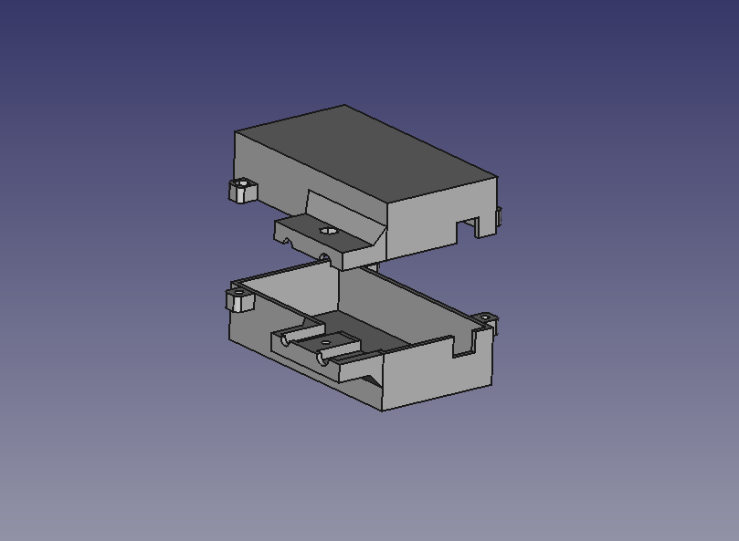
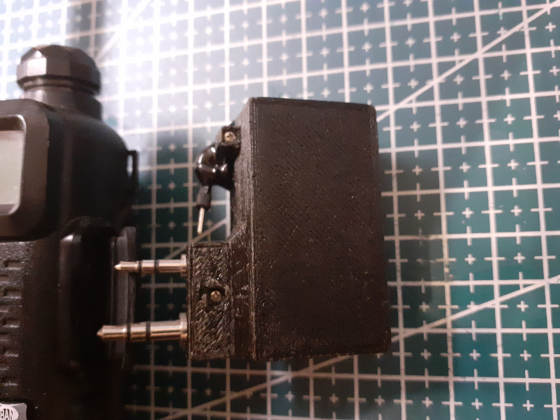

Arduino Bluetooth TNC Modem
===========================
Arduino Nano/Uno Bluetooth KISS TNC based on customized version of LibAPRS

Introduction
------------
Arduino bluetooth TNC modem is based on customized version of LibAPRS, allows 
simultaneously work using both bluetooth and USB-serial port. Uses next
peripherals:

 * &#128077; Micromodem shield for Arduino Nano - https://oshpark.com/shared_projects/NjA5xkC7
 * or Micromodem from marqvist - http://unsigned.io/micromodem/
 * Bluetooth serial adapter HC-05/HC-06

&#x26A0; For packet decoding needs additional RC filter on speaker line to overcome handheld transceiver pre-emphasis.

Building
------------
Use platformio to build and upload.

Images
-------

